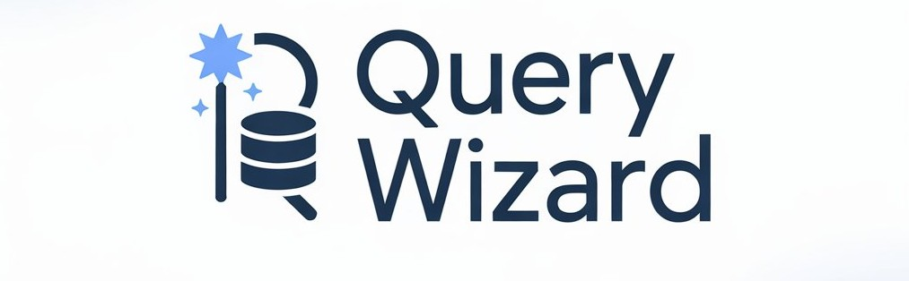

# Query Wizard 3.0

Built with Python, Gemini AI, PostgreSQL, MySQL, SQLite, Speech Recognition, and multilingual NLP.
> AI-powered database interaction platform that enables users to query databases using natural language through text or voice.




---

## 📌 Overview

Modern databases are powerful, but interacting with them still requires technical expertise.

Writing SQL queries can be difficult for beginners, business users, and multilingual audiences. Query Wizard 3.0 bridges this gap by allowing users to interact with databases using natural language instead of SQL.

Users can simply type or speak their requests, and Query Wizard automatically generates executable SQL queries while providing explanations, multilingual support, schema awareness, and real-time execution.

The platform is designed to make database interaction:

- 🌍 Accessible from anywhere
- 🗣️ Available in multiple languages
- 🎤 Voice-enabled
- 🧠 AI-assisted
- 👥 Friendly for both technical and non-technical users

---

## 🚀 Demo

🎥 Demo Video:

https://drive.google.com/file/d/1SS0zpAC1vNNCH3Ql35JETbnHiLE39-if/view?usp=sharing

🌐 Live Application:

https://query-wizard.vercel.app

📂 Repository:

https://github.com/Rishivarshney100/Query_Wizard_3.0

---

# ✨ Key Highlights

### Version Evolution

| Version | Supported Databases |
|----------|-------------------|
| V1.0 | SQLite3 |
| V2.0 | MySQL + SQLite3 |
| V3.0 | PostgreSQL + MySQL + SQLite3 |

---

## 🚀 Features

### 🧠 Natural Language to SQL
Convert plain English (or supported languages) into executable SQL queries using AI.

### 🎤 Voice Input Support
Speak your queries instead of typing.

### ⚡ Real-Time Query Execution
Execute generated queries directly on connected databases.

### 🌐 Multi-Language Support
Interact using multiple languages.

### 📊 Schema Preview
Visualize database tables and column structures.

### 💡 Query Explanation Engine
Understand what each generated SQL query does.

### 🔐 User Authentication
Secure login system for controlled access.

### 📝 History Audits
Track previous queries, responses, and activities.

### 📁 CSV Export Support
Export query outputs for analysis.

### 🧩 Modular Architecture
Designed for scalability and future enhancements.

---

## 🏗 System Workflow

```text
User Input (Text / Voice)
            ↓
Speech Recognition Layer
            ↓
Language Translation Layer
            ↓
Gemini AI Query Generator
            ↓
Query Parser & Validation
            ↓
Database Execution Engine
            ↓
Result + Explanation + History
```

---

## 🛠️ Tech Stack

### Frontend
- Streamlit

### Backend
- Python

### Databases
- PostgreSQL
- MySQL
- SQLite3

### AI & NLP
- Google Gemini AI
- SpeechRecognition
- Deep Translator

### Supporting Components
- Schema Parsing
- Query Validation
- Authentication
- Audit Logging

---

# 📂 System Architecture

### 1. High-Level Design


### 2. Low-Level Design


---

## 📂 Project Structure

```text
Query_Wizard_3.0/
├── __pycache__/              # Compiled bytecode files
├── ai_generator.py           # AI-powered SQL generation
├── db_config.py              # Database configurations
├── db_handler.py             # Query execution and DB connections
├── login.py                  # Authentication logic
├── logo.png                  # Application logo
├── main.py                   # Entry point
├── mysql_schema.json         # Schema metadata
├── prompt.py                 # Prompt templates
├── query_parser.py           # SQL parsing and validation
├── requirements.txt          # Dependencies
├── schema_handler.py         # Schema visualization
└── README.md                 # Documentation
```

---

## ⚙️ Installation

### Prerequisites

- Python 3.7+
- pip

### Clone Repository

```bash
git clone https://github.com/Rishivarshney100/Query_Wizard_3.0.git
cd Query_Wizard_3.0
```

### Create Virtual Environment (Optional)

```bash
python -m venv venv
source venv/bin/activate
```

Windows:

```bash
venv\Scripts\activate
```

### Install Dependencies

```bash
pip install -r requirements.txt
```

### Run Application

```bash
streamlit run main.py
```

---

## 🔐 Configuration

### Database Settings
Update:

```python
db_config.py
```

with your database credentials.

### Gemini API Key
Configure API keys inside:

```python
ai_generator.py
```

### Language Support
Modify:

```python
main.py
```

to add or customize supported languages.

---

## 🧪 Usage

### 1. Login
Authenticate using your credentials.

### 2. Select Database
Choose the database you want to query.

### 3. Enter Input
- Text input
- Voice input

### 4. Generate SQL
AI converts natural language into SQL.

### 5. Review Explanation
Understand what the generated query does.

### 6. Execute Query
Run the SQL and retrieve results instantly.

### 7. View Audit History
Track previous interactions and executions.

---

## 🚀 Future Enhancements

- OAuth 2.0 authentication
- Data visualization dashboards
- MongoDB support
- Redis support
- AWS RDS integration
- Query version control
- Exportable audit logs
- RAG-based schema understanding
- LangChain integration
- Enterprise observability

---

## 🚀 UI


---

## 🧪 Sample Test Cases


---

## 👨‍💻 Authors

### Rishi Varshney

- LinkedIn: https://www.linkedin.com/in/rishi-varshney100/
- LeetCode: https://leetcode.com/u/Rishi_varshney/
- Email: rishi.varshney100@gmail.com

### Tushar Ranjan

- LinkedIn: https://www.linkedin.com/in/tushar-ranjan-4186a8179/
- LeetCode: https://leetcode.com/u/tushar_ranjan/
- Email: tusharranjan151@gmail.com

---

## 📄 License

This project is licensed under the MIT License.

---

## 🙏 Acknowledgments

Special thanks to the mentors and contributors at G. L. Bajaj Institute of Technology and Management for supporting this initiative.

---

> **Query Wizard 3.0 makes database interaction as natural as a conversation.**
